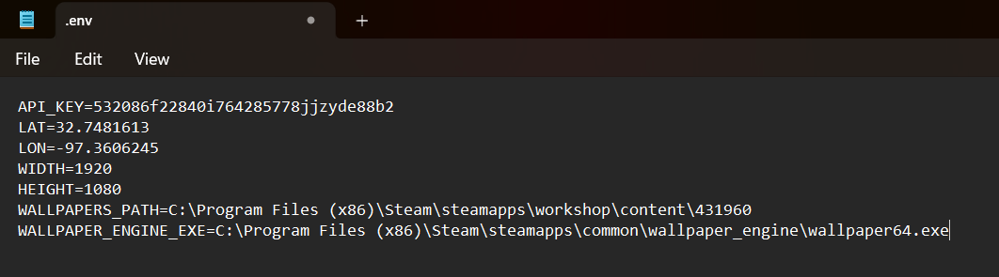
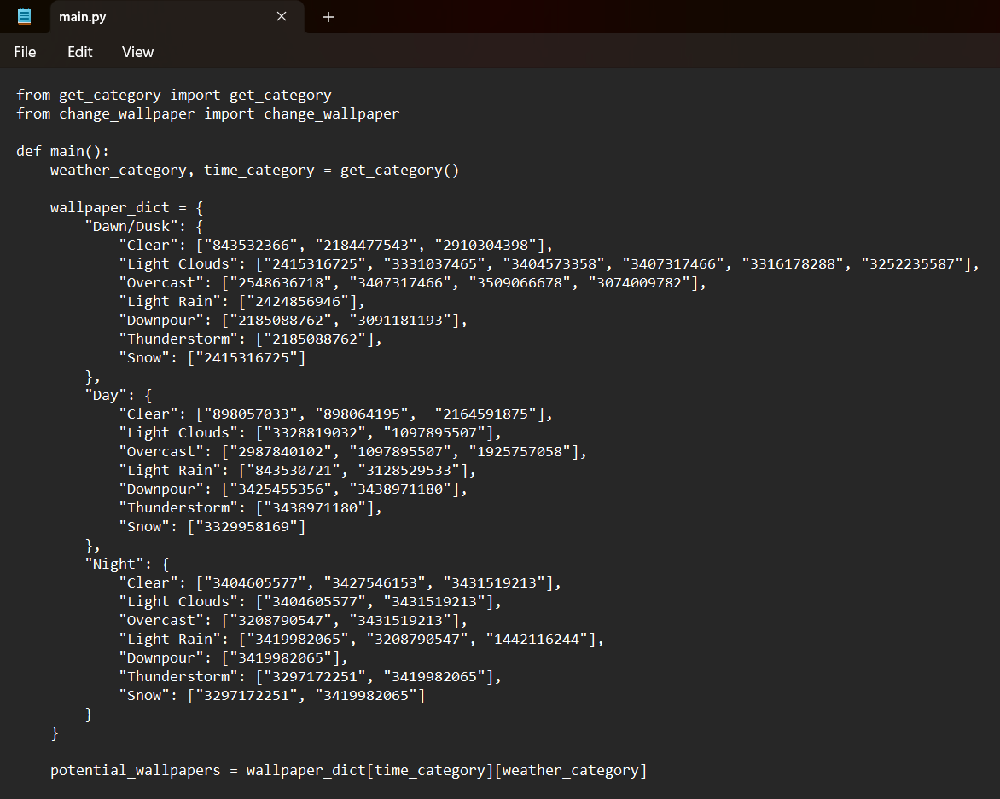
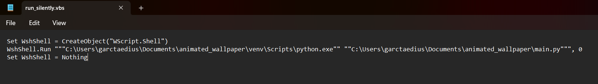

Uses OpenWeatherMap and Wallpaper Engine to change your wallpaper based on the current weather and time of day.

# Features
Enter your coordinates and your preferred Wallpaper Engine projects. Then set up a task in Windows Task Scheduler to automatically change the wallpaper based on your current weather and time of day.

Supports the following times of day:
- Dusk/Dawn
- Day
- Night

And the following weathers:
- Clear
- Light Clouds
- Overcast
- Light Rain
- Downpour
- Thunderstorm
- Snow

Meaning a total of 3x7=21 different wallpapers. You can set the same wallpaper to multiple categories, or multiple wallpapers to the same category. (In which case a random one will be selected. The same one will stay on until the category changes.)

# Requirements
You need to get Wallpaper Engine from steam [https://store.steampowered.com/app/431960/Wallpaper_Engine/](https://store.steampowered.com/app/431960/Wallpaper_Engine/). When starting the app for the first time, make sure to enable "Start automatically", and "High priority". You will also need to find the Wallpaper projects you like and subscribe to these. 

Additionally, you need an API key from OpenWeatherMap [https://openweathermap.org/](https://openweathermap.org/). The free option works well because only a couple of calls are made an hour and only the current weather is relevant. Sign up on their website, confirm your email, and go to [https://home.openweathermap.org/api_keys](https://home.openweathermap.org/api_keys) to find your key.

Finally, you will need python3 [https://www.python.org/downloads/](https://www.python.org/downloads/) (tested on python 12 and 13). Simply download the installer, and use the default settings when installing. Would probably work well with Microsoft Store version as well, but I haven't tested this.

# Installation
You will need to download the code, set up a proper python environment, and set up some environment variables.

## Set up code and python environment
- Download the directory from GitHub. Press the green "Code" button at the top and download the zip. Extract it where you want to keep the script.
- Open the terminal and navigate to the directory. If you don't know how to, do this: Go back to your extracted folder, where you can see all the project files. Press ctrl+l, then ctrl+c to copy the path to the folder you are in. Press the Windows key and type "cmd" and then enter to open the command line terminal. Type "cd " (don't miss the space), then press ctrl+shift+v to paste the path to the terminal. Press Enter.
- Set up a pip virtualenvironment ("*venv*"):
```bash
py -m venv venv
```
- Activate the environment: (If you are using PowerShell, make sure to instead run venv\Scripts\Activate.ps1, and make sure you are running as Administrator)
```bash
venv\Scripts\activate.bat
```

- Install the required packages using pip:
```bash
pip install -r requirements.txt
```

## Set up your environment variables
You will have to enter some information for the script to run properly.

Open the .env file with a text editor (you can use the standard Notepad app). You will need to fill in the following information:
- Your OpenWeatherMap API key. You can find this on the OpenWeatherMap website [https://home.openweathermap.org/api_keys](https://home.openweathermap.org/api_keys) assuming you set up your account properly. Make sure your key is marked as active! Please note that it can take a few hours for your key to activate after you have set up your account.
- Your latitude and longitude. You can find this by looking up your address on OpenStreetMaps [https://www.openstreetmap.org](https://www.openstreetmap.org) (Make sure to use a decimal *point*, not a comma)
- The width and height (in pixels) of your monitor
- The path to Wallpaper Engine. Standard location on Windows is C:\Program Files (x86)\Steam\steamapps\common\wallpaper_engine\wallpaper64.exe
- The path to your Wallpaper Engine projects. Standard location on Windows is C:\Program Files (x86)\Steam\steamapps\workshop\content\431960

Your .env file should look something like this when you are done:


## Set up your Wallpaper Engine projects
You need to add your Wallpaper Engine projects to the different categories. This is done by opening the main.py file (again, the normal Nodepad app is fine) and add the project ID to the category you want it in. To find the project ID, you can find the wallpaper project you want to add in Wallpaper Engine, and below the "Unsubscribe" button, there should be a "Copy URL" button. Press this, and you will copy a link to your clipboard. The final part of this link will say "?id=xxx", where xxx is the ID of the project. Copy this ID into the list (in between the "[]") corresponding to the time/weather category. Make sure to add quote marks ("") around the IDs, and commas between them. See image below for an example.

You can add the same project to multiple categories, and you can add multiple wallpapers to the same category. The wallpaper will not change as long as the same time/weather category is active.

Your main.py file should look something like this when you are done:


# Test your installation
Before you move on, you should test that your OpenWeatherMap API key works, and then that the script works.

## Test OpenWeatherMap API
To test that your OpenWeatherMap API key works, you can run the test_owm.py script. Go back to your terminal window (remember to activate your virtual environment if you closed the window) and type:
```bash
py test_owm.py
```

If you got a message telling you your location, weather, and time of day, congrats! You can continue with the following steps. If you got an error message, your API key might not be activated yet. Wait a couple of hours and try again before continuing. If it still doesn't work, make sure that your python environment and .env file are set up properly.

## Test script
Once that works, you should now be able to try out the script. Go back to your terminal window (remember to activate your virtual environment if you closed the window) and type:
```bash
py main.py
```

Your wallpaper should have changed! You could run the script yourself every time you want the wallpaper to change, but to have it change automatically, keep reading.

# Set up scheduled job
The following instructions show you how to set up a Windows Task Scheduler job that silently runs the script every 15 minutes when your computer is active.

## Set up your run variables
Open the run_silently.vbs file (again, Notepad is fine), and add the paths to the virtual environment you set up and the main.py file. You might be asked if you trust the file. Make sure to uncheck the "Always ask before opening this file" box, and press open. Make sure to put both paths within the quotes, space seperated, and with double double-quotes, as in the picture below. It should look something like this:


## Create Windows Task Scheduler job
Now you need to setup a Windows Task Scheduler job that runs the script automatically. The scheduler will be running the run_silently.vbs file that you just set up. This will run the script in the virtualenvironment in the background.
- Open Task Scheduler
- Press "Create Task..."
- Enter a name for your task (such as "Change Wallpaper")
- (OPTIONAL) Add a description to remember what the task does
- Check the "Run with highest privileges" box (NOTE: I don't know why it would need highest privileges, but it does not seem to work without this box checked. Feel free to experiment yourself if you want to)
- Change the "Configure for" option to your Windows version (Use "Windows 10" if you are using Windows 11)
- Switch to the "Triggers" tab. Press "New..."
- Check the "Repeat task every:" box and choose how often you want the script to run (for example, 15 minutes)
- Change the "for a duration of:" option to "Indefinitely"
- Make sure "Enabled" is checked and press OK
- Switch to the "Actions" tab. Press "New..."
- Type "wscript.exe" in the "Programs/script:" field.
- Add the path (with quotation marks) to the run_silently.vbs file in the "Add arguments (optional):" field (for example: "C:\Users\garctaedius\Documents\animated_wallpaper\run_silently.vbs")
- Press OK
- Switch to the "Conditions" tab
- Choose whatever options you prefer. I allow the program to run even if the computer is not on AC power.
- Switch to the "Settings" tab
- Uncheck "Run the task as soon as possible after a scheduled start is missed"
- Change "Stop if task if it runs longer than:" to "1 hour"
- Change "If the task is already running, then the following rule applies:" to "Stop the existing instance" (it shouldn't take more than a second to run, so if it takes too long something is wrong.)
- Press "OK"

Done! Now the Windows Task Scheduler should run the script every 15 minutes, meaning your wallpaper will change automatically if the time of day or weather changes.

# FAQ
Is this app free?
- You have to buy Wallpaper Engine on steam (around €5), but everything else is free. You can find animated wallpapers people have made in the Wallpaper Engine app. You can get a free API key from OpenWeatherMap, that has some limitations, but none that hinder this project.

Does this work on my phone?
- No, sorry! As far as I know, there is no API for Wallpaper Engine on Android, so this would not be possible.

Does the app require internet access?
- Yes! To get the current weather internet access is required. If there are periods with no internet access, no problems will arise, your wallpaper will simply stay.

What time counts as Dusk/Dawn?
- By default, 60 minutes before sunrise/sunset to 60 minutes after counts as dusk/dawn. You can change this by changing the timedelta value in the map_sunrise_sunset_to_category function in get_category.py

I have an issue/it's not working for me.
- Open an issue on this github page and I'll look at it.

Could you add this awesome feature?
- Add an issue, and label it with "enhancement", and I might add it at some point. Or add it yourself! If you know some python (or even if you don't), it shouldn't be too hard to change whatever you want. Feel free to create a pull request.
